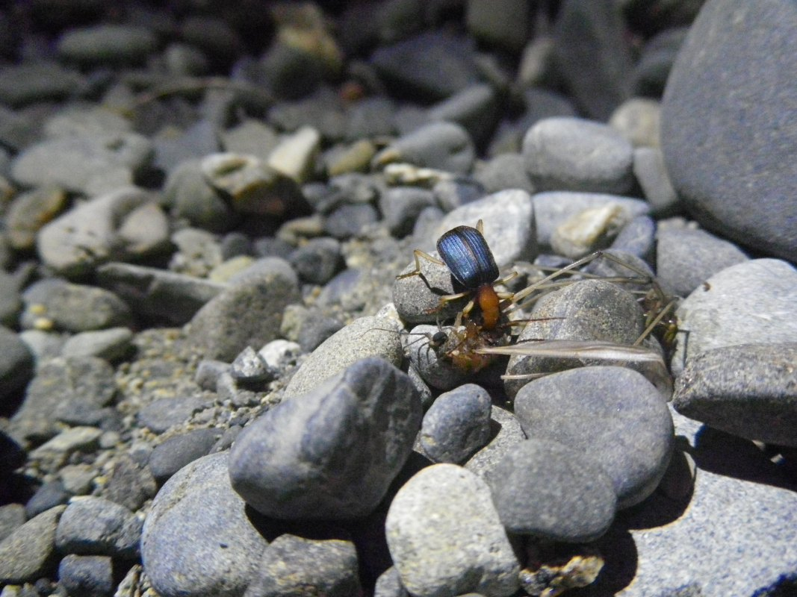

```{r setup, include = F}

knitr::opts_chunk$set(echo = F, fig.width = 5, fig.height = 4)
CEX <- LWD <- 2

```

# Course information

## BIO605 SEMINAR IN ECOLOGY

- **Instructor**: Akira Terui
- **When**: Thurs 12:30 – 14:45 (face-to-face or online)
- **Where**: Graham 303 or online
- **Virtual office hour**: By appointment
- **Required equipment**: Laptop installed with R


# What we will learn

## What is Ecology?
- Term means “the study of the household”
- Ecologists study the interactions between organisms and their environment


## What are the components of an organism’s environment?
- Physical conditions
- Chemical conditions
- **Other organisms, both the same and different species**


## Topics

<div id="left">
**Population Ecology**

- Population growth
- Density dependence
- Metapopulations

**Community Ecology**

- Competition
- Metacommunities
</div>

<div id="right">

**Food Web Ecology**

- Diet estimate
- Food chain length
</div>


## Theory & Observation

We learn theory, then expand

<div id="left">
What is the role of **theory** in ecology?

```{r}
N0 <- 10; r <- 1:3*0.1
N <- sapply(1:3, function(i) N0*exp(r[i]*seq(0, 20, length = 100)) ) 

par(mar = c(5,5,4,3))
matplot(N, type = "l", pch = 21, lty = 1,
        axes = F,
        cex = CEX, lwd = LWD, cex.lab = CEX, cex.axis = CEX,
        ylab = "Population size N", xlab = "t",
        col = rainbow(3) )
box(bty = "l")
```

</div>

<div id="right">
What is the role of **observation** in ecology?


</div>


## Theory

<div id="left">

```{r}
par(mar= c(0,0,0,0), oma = c(0,0,0,0))
plot(0, type = "n", xlim = c(0,1), ylim = c(0,1), ann = F, axes = F)
text(0.5, 0.8, "Mechanism", cex = CEX)
text(0.5, 0.2, "Pattern\n(observation)", cex = CEX)
arrows(x0 = 0.7, y0 = 0.3, y1 = 0.7, col = "gray", lwd = LWD); text(0.3, 0.5, "Theoretical\nmodel", cex = CEX)
arrows(x0 = 0.3, y0 = 0.7, y1 = 0.3, col = "gray", lwd = LWD); text(0.7, 0.5, "Statistical\nmodel", cex = CEX)

```

</div>

<div id="right">

**Theory**

- Generate predictions with given mechanisms
- e.g. Do species A & B coexist if the two species compete for a common resource with strength $\alpha$?

</div>


## Observation

<div id="left">

```{r}
par(mar= c(0,0,0,0), oma = c(0,0,0,0))
plot(0, type = "n", xlim = c(0,1), ylim = c(0,1), ann = F, axes = F)
text(0.5, 0.8, "Mechanism", cex = CEX)
text(0.5, 0.2, "Pattern\n(observation)", cex = CEX)
arrows(x0 = 0.7, y0 = 0.3, y1 = 0.7, col = "gray", lwd = LWD); text(0.3, 0.5, "Theoretical\nmodel", cex = CEX)
arrows(x0 = 0.3, y0 = 0.7, y1 = 0.3, col = "gray", lwd = LWD); text(0.7, 0.5, "Statistical\nmodel", cex = CEX)

```

</div>

<div id="right">

**Observation**

- Infer mechanisms with statistical modeling
- e.g. Species A does not co-occur with Species B - is this a result of competitive exclusion?

</div>


## Theory has up- & downsides

**Advantage**

- Ultimate mode of **experiment**
- focus on a specific mechanism(s)
- exclude confounding influences

**Disadvantage**

- There are always **assumptions**
- These assumptions often **oversimplify** the nature (mathematical constraints)
  - e.g., no immigration from other places etc.


## Observation has up- & downsides

**Advantage**

- It's real
- Reflect the full complexity of the nature

**Disadvantage**

- Multiple mechanisms can produce the same pattern
- Statistical approaches cannot separate these mechanisms, for example
  - Species A does not co-occur with species B...
  - Is this a result of competition or different environmental requirements?


## Mismatch

Mismatch b/w theory & observation is **common**

- Theory often fail to explain observed patterns 
- Motivate ecologists to develop new/novel concepts!

## Course Structure

**Part 1: Basic R exercise (Week 1 & 2)**

- The first two weeks will be devoted to learning R (**f2f**)

**Part 2: Lecture & Paper discussion (Week 3 to 12)**

- One lecture for each topic with R exercise (**f2f**)
- Student-led paper discussion (**Zoom**)

**Part 3: Synthesis (Week 13 & 14)**

- Synthesize an ecological topic of your choice
- Present & submit a term paper


## Grading

**Attendance**

- **R script** submission (lectures) - 20%
- Discussion participation (paper discussions) - 20%

**Paper Introduction**

- Presentation evaluation - 20%

**Synthesis Paper/Presentation**

- Synthesis presentation - 20%
- Term paper - 20%

Detailed guidelines will be provided!
