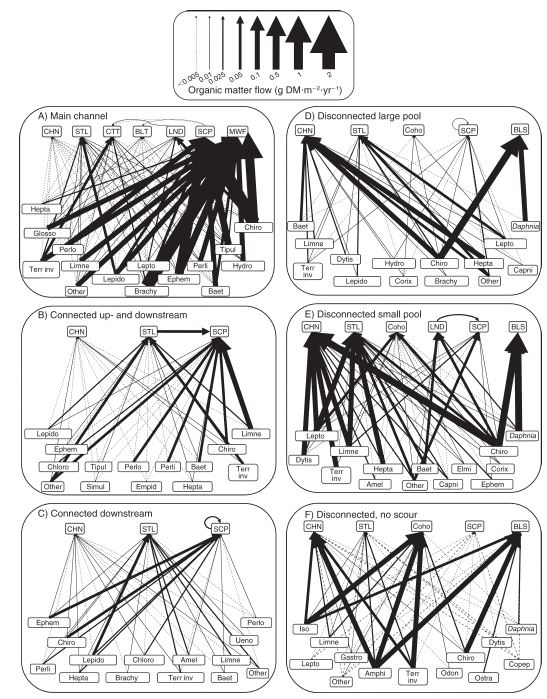
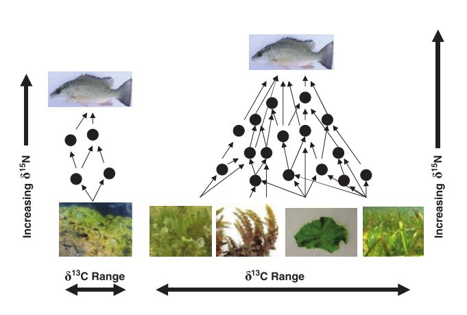
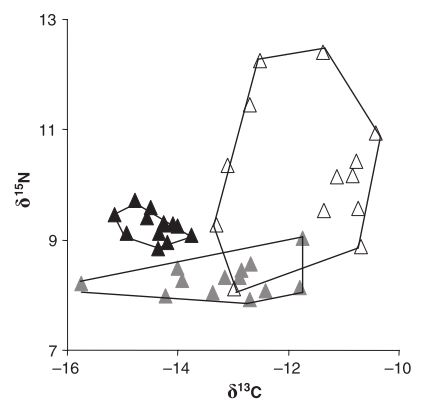

```{r setup, include = F}

knitr::opts_chunk$set(echo = F, message = F,
                      fig.width = 5, fig.height = 4, fig.align = "center")
CEX <- LWD <- 2
source("function01_fw.R")

```

# Predator-prey interaction

## Predator-prey interactions are prevalent

</img>

## The building block

Predator-prey interactions are the building blocks of a food web and affect community stability

- Links are species specific (e.g., specialist or generalist)
- Differ in strength (strong and weak interactions)

## Predator

- Carnivore
- Herbivore
- Omnivore

They take a variety of predation tactics (active, ambush hunting, etc.)

## Prey

- Behavioral avoidance
- Predator satiation (e.g., synchronized emergence)
- Mechanical
- Chemical
- Mimicry

Prey adopt a variety of anti-predator tactics

## Prey adaptation

The front door

https://youtu.be/l5Py02wqloM

The back door

https://youtu.be/qbefo_vUzog

# Predator-prey model

## The model

Lotka-Volterra **predator-prey** model

Let $x$ and $y$ be prey and predator density

$$
\frac{dx}{dt} = rx - cxy\\
\frac{dy}{dt} = b(cxy) - dy
$$

## Prey dynamics

Lotka-Volterra **predator-prey** model

$$
\frac{dx}{dt} = rx - cxy\\
$$

The term $rx$ represents the population growth of the prey

- $r$ is the intrinsic population growth rate

## Prey dynamics

Lotka-Volterra **predator-prey** model

$$
\frac{dx}{dt} = rx - cxy\\
$$

The term $cxy$ represents the predator-prey interaction

- $xy$ is proportional to the frequency of prey and predator meet
- $c$ is the rate of predation if they happen to meet


## Predator dynamics

Lotka-Volterra **predator-prey** model

$$
\frac{dy}{dt} = b(cxy) - dy
$$

The term $b(cxy)$ represents the population growth of the predator

- predator population growth depends on prey density $x$
- $b$ is the birth rate or *efficiency* that predators convert prey to reproduction


## Predator dynamics

Lotka-Volterra **predator-prey** model

$$
\frac{dy}{dt} = b(cxy) - dy
$$

The term $dy$ represents the death rate of the predator

- $d$ is the death rate

## Prediction 

Population cycle

<div id="left">
```{r}

x <- y <- NULL; x[1] <- y[1] <- 10
a <- 0.1
b <- 0.03
c <- 0.1
d <- 0.01

for(t in 1:199){
  x[t+1] <- exp(a - b*y[t])*x[t]
  y[t+1] <- exp(d*x[t] - c)*y[t]
}

plot(x, type="l", col = "salmon",
     ylab = "Density", xlab = "Time",
     axes = F)
lines(y, col = "steelblue")
box(bty = "l")
```
</div>

<div id="right">
```{r}
plot(x, y, type = "l", col = "salmon", axes = F,
     ylab = "Predator density", xlab = "Prey density")
box(bty = "l")
```
</div>

## Food web complexity

Food webs are more complex in nature

- Predators eat multiple prey species
- Interaction strength differs
- and more...

## Food web complexity and stability

Does food web complexity incease community stability?

Pimm's work (1980) looked at if a species deletion causes futher species loss in the system

<small>Pimm 1980, Oikos</small>

## Sample food webs

Which of the following is more sensitive to the basal species deletion?

<div id="left">
```{r}
fw.plot(S = 3, type = "linear", segment = F, size.var = F)
```
</div>

<div id="right">
```{r}
set.seed(1)
M2 <- rbind(c(0,0,0,1,0),
            c(0,0,0,1,0),
            c(0,0,0,1,0),
            c(0,0,0,0,1),
            c(0,0,0,0,0))

fw.plot(M = M2, type = "defined", segment = F)
```
</div>

## Sample food webs

Which of the following is more sensitive to the top predator deletion?

<div id="left">
```{r}
fw.plot(S = 3, type = "linear", segment = F, size.var = F)
```
</div>

<div id="right">
```{r}
set.seed(1)
M2 <- rbind(c(0,0,0,1,0),
            c(0,0,0,1,0),
            c(0,0,0,1,0),
            c(0,0,0,0,1),
            c(0,0,0,0,0))

fw.plot(M = M2, type = "defined", segment = F)
```
</div>


## Complexity destabilizes the system

General conclusion is greater complexity (connectance or number of species) destabilizes the system

## Complexity destabilizes the system

Opposing effects of complexity

1. Complexity increases the stability against the basal species removal\
2. Complexity decreases the stability against the predator removal

1 < 2 - as a result, complexity decreases the overall stability

## Food web complexity

There are many studies exploring the stability-complexity relationship

- May's paradox (May 1974, Stability and Complexity in Model Ecosystems)
  - Develop a random food web (interactions are randomly drawn)
  - Analyze the relationship between community stability* and complexity
  - Food web complexity destabilizes the food web
  
<small>*the maximum eigenvalue of the community interaction matrix</small>

## Food web complexity

The following properties can reverse the stability-complexity relationship

> - Dominance of weak interactions (McCann et al. 1998 Nature)
> - Adaptive foraging (Kondoh 2003, Science)
> - Mutualistic interactions (Mougi and Kondoh 2012, Science)


# Field studies: diet estimate

## How do we study predator prey interactions?

**Direct survey**\
Dissect the stomach and see what's in there

> - High resolution
> - Reflect short-term diet
> - Time consuming

## How do we study predator prey interactions?

<div id="left">
Dissect...identify all the species...measure their volume...and...
</div>

<div id="right">
</img>
<small>Bellmore 2013, Ecological Applications</small>
</div>

## Stable isotopes

Alternative approach is the use of **stable isotopes**

The same atomic # (proton), but different neutron #

**Carbon** $^{12}C$, $^{13}C$ and **nitrogen** $^{14}N$, $^{15}N$

- $^{12}C$ 98.89%, $^{13}C$ 1.11%
- $^{14}N$ 99.63%, $^{15}N$ 0.37%

## Delta expression

Stable istopes are expressed in $\delta$ values

carbon example:

$$
\delta ^{13}C (\unicode{x2030}) = 1000(\frac{R_{sample}}{R_{standard}} - 1)
$$

where $R = \frac{^{13}C}{^{12}C}$

## Fractionation

Predator cannot convert all the prey into their body tissues - predators lose some through metabolic processes

- respiration
- urine, feces

Excrete lighter isotopes first, then heavier

The ratio in predators differs from that in prey

## Fractionation

The change in $\delta$ values through predator-prey interactions is referred to as **trophic enrichment factor*** (TEF)

Carbon: $0.4 \pm 1.3 \unicode{x2030}$

Nitrogen: $3.4 \pm 1.0 \unicode{x2030}$

Carbon may reflect the basal resources, while nitrogen may reflect the vertical position in a food web

<small>Post 2002, Ecology 83: 703-718</small>

<small>*there are other names...</small>

## Fractionation

```{r, fig.height=5, fig.width=5}
x <- c(1.0, 1.4, -1.4, -1.0)
y <- c(2.0, 5.4, 0, 3.4)
plot(y ~ x, xlim = c(-2,2.5), ylim = c(-1,7),
     axes = F, cex = CEX, pch = c(21, 21, 19, 19),
     xlab = "delta C (per mille)", ylab = "delta N (per mille)")
box(bty = "l")
axis(1); axis(2)

```

## Two sources

Again, predators eat multiple prey items...

How stable isotopes help ditinguish their contributions to the diet?

## Two sources

Think caborn isotopes only

$$
\begin{align}
\delta ^{13}C (\unicode{x2030}) &= 3.0 = Y &&\text{Predator}\\
\delta ^{13}C (\unicode{x2030}) &= 1.0 = X_1 &&\text{Prey 1}\\
\delta ^{13}C (\unicode{x2030}) &= 3.0 = X_2 &&\text{Prey 2}\\
\end{align}
$$

## Two sources

Make up $Y$ with $X_1$ and $X_2$

$$
\begin{align}
Y &= \alpha (X_1 + 0.4) + (1-\alpha) (X_2 + 0.4)\\
&\text{where}\\
Y &= 3.0, X_1 = 1.0, and ~ X_2 = 3.0
\end{align}
$$

Calculate $\alpha$

$\alpha = ...$

## Mixing model

$Y$ is the weighted mean of $X_1$ and $X_2$\
($\alpha$ is the proportional contribution of $X_1$)

This is the basis of **mixing model**

```{r, fig.height = 2, fig.width=8}
par(mar = c(3,0,0,0))
plot(0, type = "n", xlim = c(0,4), ylim = c(0,0.5),
     ann = F, axes = F)
points(c(1.4, 3.4, 3), y = rep(0.08, 3), cex = 2,
       pch = 21, bg = c("white", "white", "black") )
axis(1)

```


## Mixing model

General formula

$$
\begin{align}
\delta_{j,predator} &= \sum^n_{i=1} \alpha_{i}(\delta_{j,i} + \Delta_j)\\
1 &= \sum^n_{i=1} \alpha_{i}
\end{align}
$$

- $i$ is the prey indicator (1, 2, ..., n)
- $j$ is the element indicator (carbon, nitrogen,...)


## Mixing model

Different types of mixing models

- IsoSource$^1$ (the basic model)
- **MixSIR**$^2$ (prior, uncertainties in TEF)
- **SIAR**$^3$ (prior, uncertainties in TEF)
- **IsoWeb**$^4$ (whole food web analysis)

<small>
$^1$Phillips and Gregg 2003, Oecologia\
$^2$Moore and Semmens 2008, Ecology Letters\
$^3$Parnell et al. 2010, Plos one\
$^4$Kadoya et al. 2012, Plos one\
**bold**: Bayesian implmentation
</small>

## Caution

> - Low resolution (think if $X_1$ and $X_2$ values are very close)
> - Reflect long-term diet (turnover time vaies by taxa)

## Comparison

<div id="left">
**Stomach content**

- High resolution
- Short-term
- Time consuming

</div>

<div id="right">

**Stable isotope**

- Low resolution
- Long-term
- Less time consuming
- Tricky modeling

</div>

# Field studies: niche width

## Alternative

One drawback of stable isotopes is the low resolution

However, stable isotope ratios provide the integrated measures of a food web

- <span style="color: steelblue;">Niche width</span>
- Food chain length

## Niche width

**Niche** can be defined in a variety of ways

- habitat
- physiology
- <span style="color: steelblue;">food</span>
- ...

Stable isotopes can be used as a composite measure of variation in resource use **among individuals**

## Variation in stable isotope signatures

Recall: carbon may reflect the basal resources, while nitrogen may reflect the vertical position in a food web

<div id="left">
```{r}
set.seed(1)
x <- rnorm(10, mean = 0, sd = 0.5)
y <- rnorm(10, mean = 2, sd = 1)
plot(y ~ x, pch = 21, cex = CEX,
     xlim = c(-2,2), ylim=c(-1, 4),
     bg = grey(0,0.5), col = NA, axes = F,
     xlab = "Carbon", ylab = "Nitrogen")
box(bty="l")
```
</div>

<div id="right">
```{r}
set.seed(1)
x <- rnorm(10, mean = 0, sd = 1)
y <- rnorm(10, mean = 2, sd = 0.5)
plot(y ~ x, pch = 21, cex = CEX,
     xlim = c(-2,2), ylim=c(-1, 4),
     bg = grey(0,0.5), col = NA, axes = F,
     xlab = "Carbon", ylab = "Nitrogen")
box(bty="l")
```
</div>

<small>*Points represent isotope signatures of individuals</small>

## Variation in stable isotope signatures

Recall: carbon may reflect the basal resources, while nitrogen may reflect the vertical position in a food web

</img>

<small>Layman et al. 2007 Ecology Letters</small>

## Variation in stable isotope signatures

Recall: carbon may reflect the basal resources, while nitrogen may reflect the vertical position in a food web

</img>

<small>Layman et al. 2007 Ecology Letters</small>


## Tottabetsu river

Tottabetsu River, Japan

</img>

## Ground beetles

Ground beetle - generalist predator

<div id="left">
</img>
*Brachinus stenoderus*
</div>

<div id="right">
</img>
*Lithochlaenius noguchii*
</div>


## R exercise: install SIAR

Install `siar` & `tidyverse` packages

```{r, echo = T, message=F, eval = F}
install.packages("siar")
install.packages("tidyverse")
```

Call packages in the current R session\
This will add additional functions to R

```{r, echo=T}
library(siar)
library(tidyverse)
```

<small>functions in packages must be called through `library()` everytime you open a new R session; otherwise you'll get error messages</small>


## R exercise: read data

Download `sample_data.csv` and read it into R

```{r, echo = T, message = F}
dat <- read.csv("data/sample_data.csv")
head(dat)
```


## R exercise: data formatting

Check `species` column

```{r, echo = T, message=F}
unique(dat$species)
```

## R exercise: data formatting

Filter rows

```{r, echo = T, message=F}
# L. nogutii
dat_ln <- filter(dat, species == "L_noguchii")
unique(dat_ln$species)

# B. stenoderus
dat_bs <- filter(dat, species == "B_stenoderus")
unique(dat_bs$species)
```

## R exercise: convex hull

Calculate convex hull with `convexhull`

`x` carbon data\
`y` nitrogen data

```{r, echo = T, message=F}

estln <- convexhull(x = dat_ln$d13C, y = dat_ln$d15N)
estbs <- convexhull(x = dat_bs$d13C, y = dat_bs$d15N)

```


## R exercise: covex hull

Inspect *L. noguchii*

```{r, echo = T, message=F}
estln
```


## R exercise: covex hull

Inspect *B. stenoderus*

```{r, echo = T, message=F}
estbs
```


## R exercise: visualize

Visualize the convex hulls

```{r, echo = T, message=F, eval = F}

# set plot region
plot(0, type = "n",
     xlim = range(dat_ln$d13C, dat_bs$d13C),
     ylim = range(dat_ln$d15N, dat_bs$d15N),
     ylab = "delta N", xlab = "delta C")

# for L.noguchii
points(d15N ~ d13C, data = dat_ln, pch = 19) # add points
polygon(estln$xcoords, estln$ycoords) # draw polygon

# for B.stenoderus
points(d15N ~ d13C, data = dat_bs, pch = 21,
       col = NA, bg = grey(0, 0.2)) # add points
polygon(estbs$xcoords, estbs$ycoords,
        col = grey(0, 0.2), border = grey(0, 0.5)) # draw polygon

```

## R exercise: visualize

```{r, echo = F, message=F, eval = T, fig.height=5, fig.width=5}

# set plot region
plot(0, type = "n",
     xlim = range(dat_ln$d13C, dat_bs$d13C),
     ylim = range(dat_ln$d15N, dat_bs$d15N),
     ylab = "delta N", xlab = "delta C")

# for L.noguchii
points(d15N ~ d13C, data = dat_ln, pch = 19) # add points
polygon(estln$xcoords, estln$ycoords) # draw polygon

# for B.stenoderus
points(d15N ~ d13C, data = dat_bs, pch = 21, col = NA, bg = grey(0, 0.2)) # add points
polygon(estbs$xcoords, estbs$ycoords,
        col = grey(0, 0.2), border = grey(0, 0.5)) # draw polygon

```
